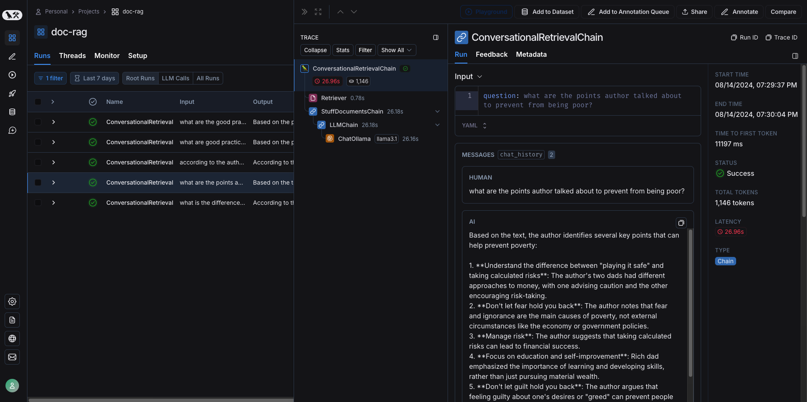

# RAG Documnet
## Pre-requisite for this project
1. Working of LLMs
2. Working of vectorstore database

## Project Depandencies
1. python = "^3.10"
2. transformers = "^4.43.3"
3. langchain = "^0.2.12"
4. chromadb = "^0.5.5"
5. ollama = "^0.3.1"
6. chainlit = "^1.1.402"

Checkout all the depandencies [here](https://github.com/sinha96/rag-document/blob/master/pyproject.toml).

### Other Depandencies
We are using ollama to host a LLM server in which we are using quantized <b><i>LLaMa3.1:8b</b></i> model from Meta. In terms of encoder we are using <b><i>paraphrase-multilingual-MiniLM-L12-v2</b></i>.

## API setup
At the project level create a env file which should have below lines:

```
LANGCHAIN_API_KEY=<your api key>
LANGCHAIN_TRACING_V2=true
LANGCHAIN_ENDPOINT="https://api.smith.langchain.com"
LANGCHAIN_PROJECT=<your_project_name>
```

This will help you to keep track of Chain-of-Thought of your RAG agent. Illustrated below:



## How to get started
1. Download LLaMa3.1 using below command:
```
ollama pull llama3.1
```
2. Start Ollama server.
```
ollama serve
```
3. start the RAG server in reload mode.
```
uvicorn app:app --reload
```

## Using the application
### 1. Pushing documnet
Send an api request to store you documents(pdf) into vector database.

```
curl -d @path/to/data.pdf http://localhost:8000
```

Also, we can use FastAPI UI/Postman to send document


### 2. Query the ollama model
Below is an example how we can interact with ollama server
1. Using Python
```
import requests
model_url = "http://localhost:11434/api/generate"
headers = {
    'Content-Type': 'application/json'
}
payload = {
    "model": "llama3.1",
    "stream": False,
    "promt": "<Your_Question>"
}
response = requests.post(
    model_url, 
    data=json.dumps(self.payload), 
    headers=self.headers
)
response = response.json()
```

2. Using curl without streaming
```
curl http://localhost:11434/api/generate -d '{
  "model": "llama3.1",
  "prompt":"Why is the sky blue?"
  "stream": false
}'
```


3. Using curl with chat mode
```
curl http://localhost:11434/api/chat -d '{
  "model": "llama3.1",
  "messages": [
    { "role": "user", "content": "why is the sky blue?" }
  ]
}'
```

### Using UI
To start the RAG Application UI use the below command:
```
chainlit run <path-to-your-app.py>  -w
```
-w is used to reload the app whenever app detects change in the code.


## Future Updates
- [X] Chat UI
- [ ] Chat history persistence
- [ ] Compatibility for docx, txt, web url
- [ ] Multi-model agent which redirect requests based on user query
- [ ] Compatibility for images

